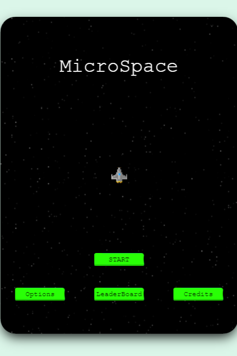

[![Contributors][contributors-shield]][contributors-url]
[![Forks][forks-shield]][forks-url]
[![Stargazers][stars-shield]][stars-url]
[![Issues][issues-shield]][issues-url]
[](https://opensource.org/licenses/MIT)
[![LinkedIn][linkedin-shield]][linkedin-url]


<!-- PROJECT LOGO -->
<br />
<p align="center">
  
  <h1 align="center">MicroSpace</h1>

  <p align="center">
    Space Shooter Game build with Phaser 3 
    <br />
    <a href="#about-the-project"><strong>Explore the docs »</strong></a>
    <br />
    <br />
    <a href="https://micr0space.herokuapp.com/" target="_blank" >View Demo</a>
    ·
    <a href="https://github.com/tigamadou/miscrospace/issues">Report Bug</a>
    ·
    <a href="https://github.com/tigamadou/miscrospace/issues">Request Feature</a>
  </p>
</p>

# Table of Contents

- [About the Project](#about-the-project)
- [Built With](#built-with)
- [Game Design Document(GDD)](#game-design-document)

* [Getting Started](#getting-started)
  * [Prerequisites](#prerequisites)
  * [Installation](#installation)
- [What is MicroSpace](#what-is-grab-fruits)
- [How to run the game](#how-to-run-the-game)
- [How to play the game](#how-to-play-the-game)
- [Game Rules](#rule-of-the-game)
- [Author](#author)
- [Contributing](#contributing)
- [Show your support](#show-your-support)
- [License](#license)
- [Acknowledgements](#acknowledgements)


# About the Project

<div align="center">



</div>
This is a Space Shooter game build with **Phaser 3** library.
It was build for a Javascript capstone projet at Microverse.

For this project, the requirements are:

- Implement it with **Phaser** library
- Implement a scoring system and using a provided **api** to save the user name and score
- Deploy the game on a server to make it accessible online
- Include description of the game desing
- Provide instruction on how to run the game in local environment

In addition, I added the following features:

- 20 level weapons for the player
- 20 level stage to play

# Built With

- [CSS](https://en.wikipedia.org/wiki/CSS)
- [JavaScript](https://en.wikipedia.org/wiki/JavaScript)
- [Phaser 3](https://phaser.io/phaser3)
- [Webpack](https://phaser.io/phaser3)

# Game Design Document

[Game Design Document (GDD) Link](./game-design-document.md)

# Getting Started
To get the game on your own computer, please do the following steps

## Prerequisites
This app require: nodejs. If you don't have not installed yet, do the following commands in your terminal.
* git
* nodejs & npm
```sh
npm install npm@latest -g
```
* yarn (Optional)
```sh
npm install --global yarn
```

## Installation
Once your computer meets all the requirements you can proceed to the next steps.

1. Open your command terminal

2. Clone the repo from github

```sh
git clone https://github.com/tigamadou/microspace
```

3. Browse to the cloned folder
```sh
cd microspace
```

3. Install NPM packages using npm or yarn
```sh
npm install 'or' yarn 
```
4. Build the game
```sh
npm run build 'or' yarn build
```

## What is MicroSpace
MicraoSpace is a Space shooter browser game. To score points, the player need to shoot the enemies and proceed to the next Stage.

## How to run the Game
Once all the precious steps completed, run the following command
1. Run the start command in your terminal
```sh
npm run start 'or' yarn start
```
2. Your browser will automatically open with the address http://127.0.0.1:8051

## How to Play the Game
1. Run The game using the instructions above
2. On the Title Scene
    - Start to start a new game
    - Options to enter the game options
    - LeaderBoard to see the top players
    - Credits to see the closing credits of the game
4. Click Start to run a new game
    - Chose a name and click save
    - Read your mission details and instructions. Click Accept to proceed
        * You can move with both  W S A D keys and UP DOWN LEF RIGHT arrows key
        * Use space to shoot
        * Good Luck
    - If you complete the stage you'll progress to the next Stage

## Game RUles
1. A player can be moved using arrow keys but also common w a s d keys.
2. The Player use the space bar to shoot lasers. 
3. There are 4 types of lasers each one having 5 speed level.
4. There are 4 types or enemies
5. The score is increased each time an enemy is destroyed. The score gained depends on the enemy and the level.
6. The game is over when the player is destroyed by a laser shoot or a colision with an enemy


      
## Author

👤 **Amadou Ibrahim**

- GitHub: [@tigamadou](https://github.com/tigamadou)
- Twitter: [@tigamadou](https://twitter.com/tigamadou)
- Linkedin: [Amadou IBRAHIM](https://www.linkedin.com/in/amadou-ibrahim/)


## Contributing

Contributions, issues, and feature requests are welcome!
Feel free to check the [issues page](../../issues).

1. Fork the Project
2. Create your Feature Branch (`git checkout -b feature/AmazingFeature`)
3. Commit your Changes (`git commit -m 'Add some AmazingFeature'`)
4. Push to the Branch (`git push origin feature/AmazingFeature`)
5. Open a Pull Request


## Show your support

Give a ⭐️ if you like this project!


## License

This project is [MIT](./LICENSE) licensed.


## Acknowledgements
* [Microverse](https://microverse.org)
* [WebPack](https://getbootstrap.com)
* [Javascript ES6](https://github.com/facebook/react/)
* [Eslint](https://eslint.org/)
* [GitHub Actions](https://github.com/features/actions)
* [Heroku](https://heroku.com)
* [Phaser3](https://phaser.io/phaser3)
* [axios](https://github.com/axios/axios)
* [Opengameart.com](https://opengameart.org/)
* [SFX](https://opengameart.org/)
* [Cute astronaut flying with planet balloons in space cartoon created by catalyststuff - www.freepik.com -](https://www.freepik.com/free-vector/cute-astronaut-flying-with-planet-balloons-space-cartoon_11766657.htm#&position=26)
* [Build a Space Shooter with Phaser 3](https://learn.yorkcs.com/category/tutorials/gamedev/phaser-3/build-a-space-shooter-with-phaser-3/)
* [How (And Why) to Write a Great Game Design Document](https://gamedevelopment.tutsplus.com/articles/how-and-why-to-write-a-great-game-design-document--cms-23545)
* [Creating a Phaser 3 Template](https://phasertutorials.com/creating-a-phaser-3-template-part-1/)


<!-- MARKDOWN LINKS & IMAGES -->
<!-- https://www.markdownguide.org/basic-syntax/#reference-style-links -->

[contributors-shield]: https://img.shields.io/github/contributors/tigamadou/microspace.svg?style=flat-square
[contributors-url]: https://github.com/tigamadou/microspace/graphs/contributors
[forks-shield]: https://img.shields.io/github/forks/tigamadou/microspace.svg?style=flat-square
[forks-url]: https://github.com/tigamadou/miscrospace/network/members
[stars-shield]: https://img.shields.io/github/stars/tigamadou/microspace.svg?style=flat-square
[stars-url]: https://github.com/tigamadou/microspace/stargazers
[issues-shield]: https://img.shields.io/github/issues/tigamadou/microspace.svg?style=flat-square
[issues-url]: https://github.com/tigamadou/microspace/issues
[license-shield]: https://img.shields.io/github/license/tigamadou/microspace.svg?style=flat-square
[license-url]: https://github.com/tigamadou/microspace/blob/master/LICENSE.txt
[linkedin-shield]: https://img.shields.io/badge/-LinkedIn-black.svg?style=flat-square&logo=linkedin&colorB=555
[linkedin-url]: https://linkedin.com/in/amadou-ibrahim
[product-screenshot]: images/screenshot.png
