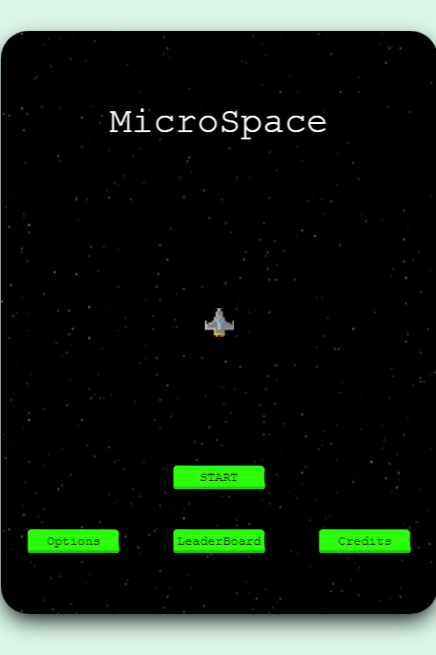

**🎮️ Name of the game:  MicroSpace\
👥 Stakeholders:**

* Dev: [Amadou Ibrahim](https://github.com/microspace)
* Design: [Amadou Ibrahim](https://github.com/microspace)
* QA:[Amadou Ibrahim](https://github.com/microspace)

## Game Design Document

###   Genre
    

    A SPACER SHOOTER GAME

###  Core Gameplay Mechanics 
    

1.  Shoot enemies to get points

2.  Survive and proceed to the next Stage.

3.  Get a different weapon at each stage

4.  The Enemies are stronger and faster at each stage

3.  Send your score to an online leaderboard

### Targeted platforms
    

1.  Web Browser (PC ONLY)

### Project Scope 
    

1.  Development Resources

    -   No incurring costs in money

    -   5 days from development to launch.

2.  Phase3 Developer License

3.  Heroku Hobby Dyno

###  The Elevator Pitch
    
    A lightweight space shooter game right in your browser. Play, challenge the game, complete the stages, destroy the enemies and get the highest scores to be listed on the leaderboard. Go through all the 20 stages and discover all the awesome possibilities awaiting you. Play now.

###   Project Description
    
    A simple game build with Phaser 3 Game Engine. The game is available on any Phaser 3 compatible browser with a keyboard connected.
    
    

## What sets this project apart?

1.  It's a JS game in the browser. 

2.  No need to learn any rules to play. Just destroy all the enemies and stay alive.

3.  You can listed in the TOP 10 players on the leaderboard.

-   Core Gameplay Mechanics
    ----------------------------------

1.  Shoot as many enemies as possible to get points

-   Any destroyed enemy rewards the player with one point. 

-   The player can shoot them using the spacebar 
2.  Stay alive for the stage duration to proceed to the next one

2.  Get new weapon on each stage

3.  Get your score an the online leaderboard if Top Ranked

## Story and Gameplay

### Story
    

1.  Welcome to the BattleField. The universe is in danger. Billions of life are in danger. Your mission, if you accept it, is to save the universe and stop the fleet of the Galactic Empire. You are our only hope.

-   Gameplay
    ----------------

1.  The player has to survive in 20 different scenarios with a time set  per scene at the same time scores as many points as it can. 

2.  The game finishes when the player completes the last scenario or receives an impact from the enemies.

3. There are 4 rank of enemies. Each enemy destroyed increase the score according to its rank:
    - Rank 1 : +100
    - Rank 2 : +250
    - Rank 3 : +500
    - Rank 4 : +1000
4. The enemies have lives score according to their rank and the current stage/level
    - Rank 1 : 50 * level * l.2
    - Rank 2 : 80 * level * l.2
    - Rank 3 : 100 * level * 1.2
    - Rank 4 : 800 * level * 1.2

4. The Player fire rate and power is calculated according to the level
    - Power : 50 * level * 1.3
    - Rate : 30 - (5 * level)
    - Speed : 200 + ( level *200)

### Assets

-   2D
    --

1.  Textures

-   Animated Player ship

-   Animated Gun ships

-   Animated Chaser ships

-   Animated Carrier ships

-   Laser 

2.  Backgrounds

    -   Planetary.
    -   Deep space

    -   Sound
    -----

1.  Sound List

    -   Title sound

    -   Battle sound

    -   Game over sound

    -   Explosion sound

    -   Shoot sound

### Code
    

1.  Phase 3 Engine

2.  Webpack 

3.  HTML Index page

4.  Jest 

5.  JS Modules

## Author

👤 **Amadou Ibrahim**

- GitHub: [@tigamadou](https://github.com/tigamadou)
- Twitter: [@tigamadou](https://twitter.com/tigamadou)
- Linkedin: [Amadou IBRAHIM](https://www.linkedin.com/in/amadou-ibrahim/)

